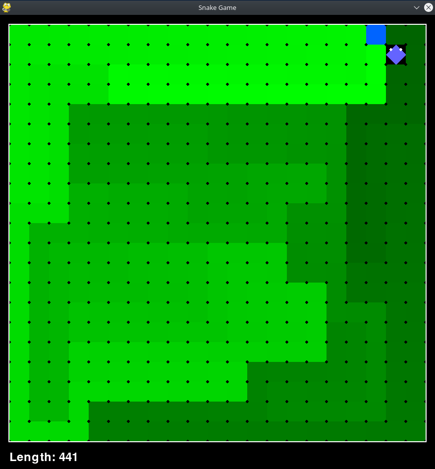

This repository is forked from https://github.com/linyiLYi/snake-ai
# Multi-Coach Snake AI
## Introduction

This repository implements the multi-coach algorithm, which originates from one of my capstone projects in NCHU.
The agent trained by this algorithm is able to play 21x21 Snake Game and has a chance to achieve the max length of snake.

Demo Video: https://www.youtube.com/watch?v=3e3IhCKUG1Y

Original Report (pdf):

## Requirements
* python 3.10.13: This project is only tested on python 3.10.13.

* ```pip install stable-baselines3[extra]```: This module implements the core part of reinforcement-learning-algorithms. We use the PPO in this project. By the way, the ```[extra]``` flag helps install all other modules good for the training process, including Tensorboard, tqdm, etc.

* ```pip install sb3-contrib```: We use the MaskablePPO of this module for part of training process.

## How to Test the Snake Game
1. ```cd main```
2. Run ```python test_cnn.py``` to watch the final agent play the Snake Game.

## How to Train the Final Agent
1. ```cd main```
2. Run ```python train_cnn_nextstage_largernet3_BOSS.py```. (The pretrained coaches are located in main/coaches. Running this code will read these coaches.)

## Functions of Each Python Files

## How to Train Coaches

## How to Perform Policy Evaluation

## Acknowledgements
The external code libraries used in this project include [Pygame](https://www.pygame.org/news)、[OpenAI Gym](https://github.com/openai/gym)、[Stable-Baselines3](https://stable-baselines3.readthedocs.io/en/master/). Thanks all the software developers for their selfless dedication to the open-source community!

The convolutional neural network used in this project is from the Nature paper:

[1] [Human-level control through deep reinforcement learning](https://www.nature.com/articles/nature14236)
